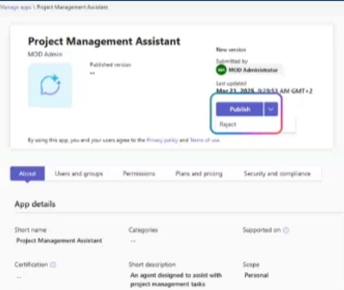

🚀 **The Copilot Agent Administration Feature Series!** 🚀

Agent Admin Approval Agent authors can publish their agents created in Copilot Studio or Teams Toolkit to tenant's app catalog.
 Admins need to approve/reject publishing which can be done in Microsoft 365 Admin Center >Integrated AppsTeams Admin Center > Manage Apps Publishing new version of the agent also requires admin approval.
**Microsoft 365 Admin Center:**

Admins can review agent metadata before making agents available with Approve action.
When an agent is submitted for admin approval, all metadata about agent definition is provided on app details tab in Microsoft 365 Admin Center > Integrated apps to equip.
M365 admin with all information about the agent, including capabilities, data sources,
and custom actions that the agent can invoke.

**Teams Admin Center:** 

Admins can Approve/Reject publishing of the agents in Teams Admin Center.

Information about the agent, capabilities, data sources, and custom actions are not available yet in Teams Admin Center.
After agent has been approved and published, admins have following controls in Microsoft 365 and Teams Admin Centers. 
1. Define who can access the agent.
2. Deploy app to target audience.
3. Block the agent.
